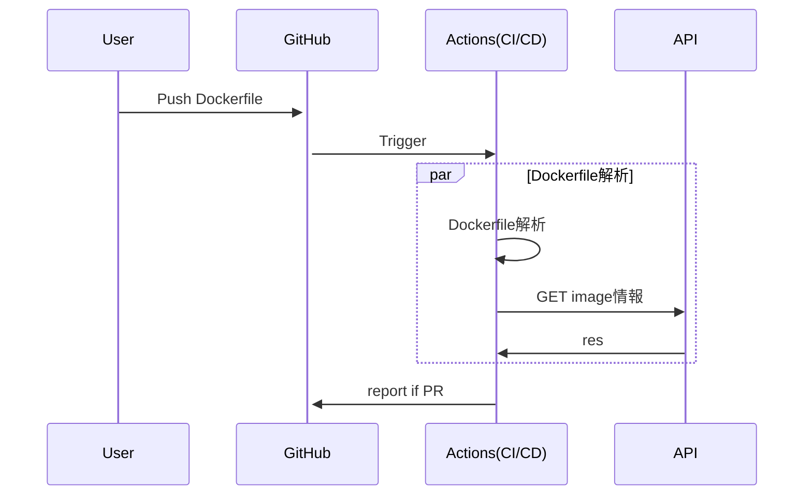

# docker-scanner

```mermaid
sequenceDiagram
    participant user as User
    participant github as GitHub
    participant actions as Actions(CI/CD)
    participant API
        
    user ->>+github: Push Dockerfile
    github ->>actions: Trigger
    par Dockerfile解析
    actions ->>actions: Dockerfile解析
    actions ->>API: GET image情報
    API->> actions: res
    end
   actions ->>github: report if PR
```