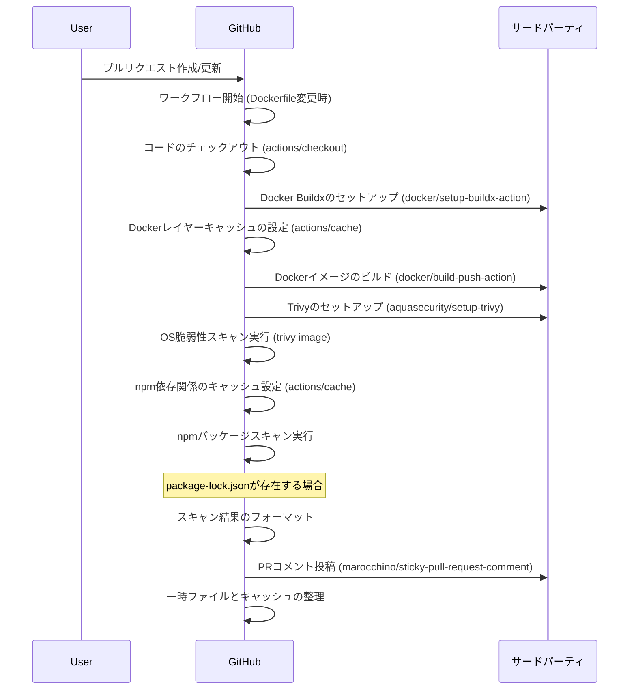

## DockerScanner 要件定義

### Goal
- OSSを活用してDockerイメージのセキュリティ診断とDevSecOpsの実践
- 分析内容
  - ベースイメージのセキュリティ診断
  - パッケージの脆弱性診断
  - ファイルの検査 (credential, secret, ...)

### Non-Goal
- 低レイヤの脆弱性診断
- 0からのScannerの実装

### Requirement
- Dockerイメージのセキュリティ診断
  - ベースイメージのセキュリティ診断
  - パッケージの脆弱性診断
  - ファイルの検査
- reportの出力
  - PRにコメント（トリガーはPullRequest Openとする）

### Non-Functional Requirement
- OSSを活用する
- GitHub ActionsでのCI/CDの想定・実装

## DockerScanner 設計
- OS脆弱性スキャン
- npmパッケージスキャン

